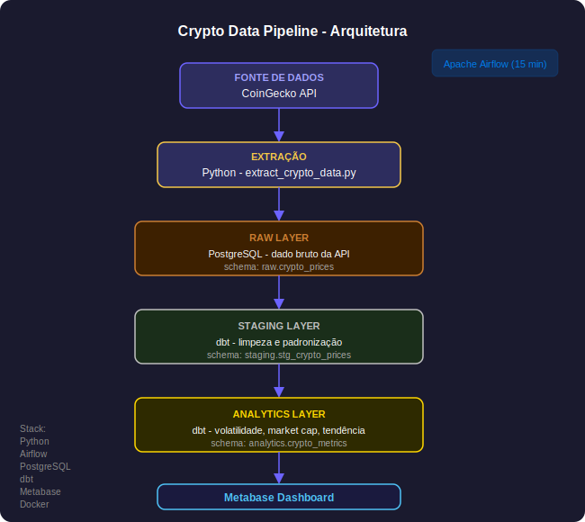

# Crypto Data Pipeline

Pipeline de engenharia de dados para coleta, transformação e análise de preços de criptomoedas, com atualização automática a cada 15 minutos via Apache Airflow.

---

## Problema

Acompanhar o comportamento de criptomoedas exige dados atualizados com frequência e métricas calculadas de forma consistente. Este pipeline automatiza a coleta via API, organiza os dados em camadas e entrega métricas de volatilidade, market cap e tendência prontas para consumo no dashboard.

---

## Fonte de Dados

API pública CoinGecko, sem autenticação, com dados de preço, volume e market cap das principais criptomoedas. Coleta executada a cada 15 minutos pelo Airflow.

---

## Arquitetura



---

## Decisões de Arquitetura

**Por que Airflow para orquestração?**
O pipeline precisa ser executado a cada 15 minutos de forma confiavel, com logs de execucao e possibilidade de reprocessamento em caso de falha. O Airflow resolve isso nativamente com DAGs, sem precisar gerenciar cron jobs manualmente.

**Por que dbt para transformacao?**
O dbt separa claramente a responsabilidade de transformacao do codigo de extração. Cada modelo e uma query SQL versionada, testavel e documentada. Isso torna o pipeline mais facil de manter e auditar.

**Por que PostgreSQL?**
Volume compativel com banco relacional. PostgreSQL suporta schemas separados por camada (raw, staging, analytics), o que implementa a Medallion Architecture sem precisar de infraestrutura distribuida.

**Por que Docker?**
O ambiente tem quatro servicos (Python, Airflow, PostgreSQL, Metabase) com dependencias especificas. Docker garante que o pipeline funcione igual em qualquer maquina, sem conflito de versoes.

---

## Stack

- Python: extração de dados da API
- Apache Airflow: orquestração do pipeline
- PostgreSQL: armazenamento em camadas
- dbt: transformacao e modelagem
- Metabase: visualizacao
- Docker: containerização do ambiente

---

## Camadas de Dados

**Raw** - dado bruto exatamente como veio da API CoinGecko.
Schema: `raw.crypto_prices`

**Staging** - dados limpos e padronizados pelo dbt.
Schema: `staging.stg_crypto_prices`

**Analytics** - métricas prontas para consumo: classificacao de volatilidade (Alta/Média/Baixa), categorização de market cap (Large/Mid/Small Cap) e identificação de tendência (Subindo/Caindo/Estavel).
Schema: `analytics.crypto_metrics`

---

## Estrutura

```
crypto-pipeline/
├── dags/
│   ├── crypto_pipeline_dag.py
│   └── crypto_pipeline_complete.py
├── scripts/
│   ├── extract_crypto_data.py
│   └── init_db.sql
├── dbt/
│   ├── models/
│   │   ├── staging/
│   │   │   ├── stg_crypto_prices.sql
│   │   │   └── schema.yml
│   │   └── marts/
│   │       └── crypto_metrics.sql
│   ├── dbt_project.yml
│   └── profiles.yml
└── docker-compose.yml
```

---

## Como Executar

Pré-requisitos: Docker Desktop e 8GB de RAM. Portas livres: 5433, 8081, 3001.

```bash
# 1. Clone o repositorio
git clone https://github.com/luciendelalves/crypto-data-pipeline.git
cd crypto-data-pipeline

# 2. Suba os containers
docker compose up -d

# 3. Aguarde 2-3 minutos para inicialização

# 4. Acesse as interfaces
# Airflow:  http://localhost:8081  (admin / admin)
# Metabase: http://localhost:3001
```

No Airflow, ative a DAG `crypto_pipeline_complete` e execute manualmente clicando em play.

---

## Qualidade de Dados

Validações implementadas via dbt tests no schema.yml:

```yaml
models:
  - name: stg_crypto_prices
    columns:
      - name: id
        tests:
          - not_null
          - unique
      - name: current_price
        tests:
          - not_null
      - name: market_cap
        tests:
          - not_null
```

Alem dos testes do dbt, o script de extração valida antes de inserir no banco:

```python
assert df['current_price'].isnull().sum() == 0, "Preco nulo encontrado"
assert df['id'].duplicated().sum() == 0, "Duplicatas encontradas"
```

---

## Queries Analiticas

```sql
-- Criptomoedas com maior volatilidade
SELECT
    name,
    volatility_class,
    ROUND(price_change_24h, 2) AS variacao_24h
FROM analytics.crypto_metrics
WHERE volatility_class = 'Alta'
ORDER BY ABS(price_change_24h) DESC;

-- Distribuição por categoria de market cap
SELECT
    market_cap_category,
    COUNT(*) AS total_moedas,
    ROUND(AVG(current_price), 2) AS preco_medio
FROM analytics.crypto_metrics
GROUP BY market_cap_category
ORDER BY total_moedas DESC;

-- Tendência atual do mercado
SELECT
    trend,
    COUNT(*) AS total_moedas
FROM analytics.crypto_metrics
GROUP BY trend
ORDER BY total_moedas DESC;
```

---

## Próximos Passos

- Alertas por Slack ou email em caso de falha na DAG
- Snapshot histórico para analise de series temporais
- CI/CD com GitHub Actions

---

## Descobertas Analíticas

As métricas calculadas na camada analytics revelam padrões interessantes do mercado de criptomoedas.

**Volatilidade:** A maioria das moedas monitoradas se concentra na classe de volatilidade Alta, refletindo o comportamento típico do mercado cripto, onde variações de dois dígitos em 24 horas são comuns mesmo nas moedas de maior capitalização.

**Market cap:** A distribuição entre Large, Mid e Small Cap mostra que poucas moedas concentram a maior parte do volume de negociação. Bitcoin e Ethereum dominam a categoria Large Cap e puxam a média de preço da categoria para cima de forma expressiva.

**Tendência:** O pipeline captura momentos distintos do mercado. Em períodos de alta geral, a maioria das moedas aparece como Subindo. Em correções, a categoria Caindo domina, o que permite identificar o sentimento geral do mercado em cada coleta.

> Estes insights foram observados durante a execução do pipeline. Para resultados atualizados, suba o ambiente e consulte o dashboard no Metabase em http://localhost:3001.